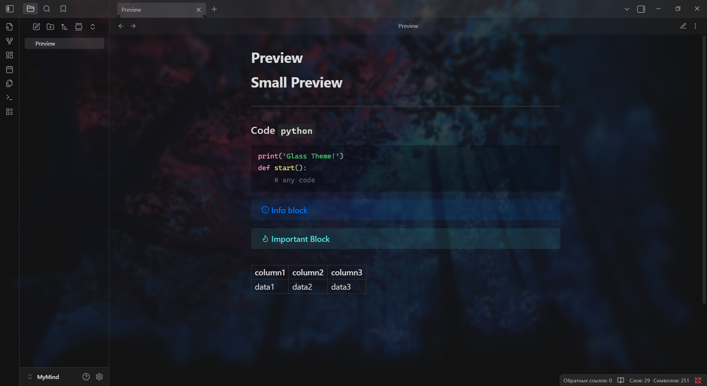

---

Снипет для Obsidian, который делает прозрачный фон и позволяет ставить на фон изображение. Сделан на основе стандартной темы Obsidian.

## 📕 Превью

## 📌 Установка

1. Скачайте архив 
2. Поместите один из `.css` файлов в папку
``[your-obsidian-vault]/.obsidian/snippets``
3. Включите сниппет в настройках на странице `оформление`

❤️ Created by XCraiteX
